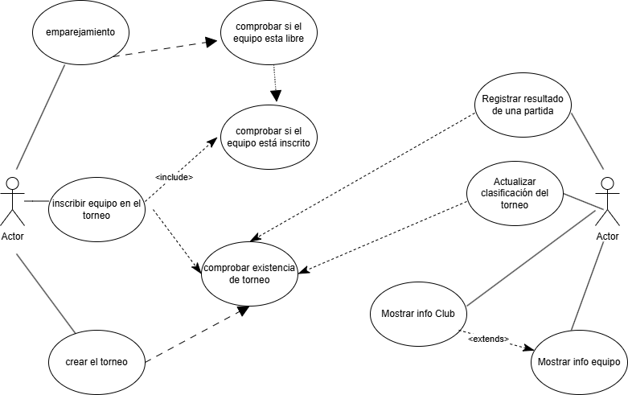
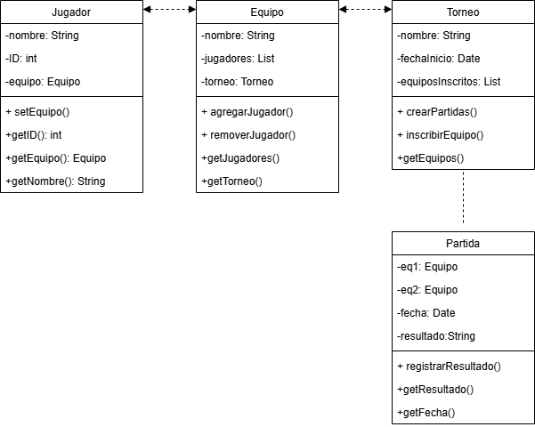

#Sistema de Gestion de Torneos de eSports

##Beatriz Waliño Pérez

https://github.com/BeatrizWali/torneo-esports-uml.git

## Descripción del Proyecto
Este proyecto es un **Sistema de Gestión de Torneos de eSports**. 
Utiliza **UML** para diseñar cómo funciona y **Java** para hacer que el sistema funcione. 
El sistema ayuda a los administradores a crear torneos, gestionar equipos, jugadores, partidas y premios.
1. Análisis del problema y requisitos del sistema
1. ¿Quiénes son los actores que interactúan con el sistema?
•	Administrador: Es la persona que gestiona los equipos, a los jugadores, partidas y premios.
•	Jugador: participe de un equipo que participa en torneos.
•	Sistema: se encarga de automatizar procesos internos. 
•	
2. ¿Cuáles son las acciones que cada actor puede realizar?
	
Administrador: Registrar equipos, añadir jugadores, crear torneos, inscribir equipos, registrar resultados, asignar premios…
Jugador: participar en torneos, ver resultados.
Sistema: Actualizar clasificaciones.

3. ¿Cómo se relacionan entre sí las entidades del sistema?
•	Un equipo está formado por uno o varios jugadores.
•	Un torneo contiene varios equipos inscritos.
•	Un torneo tiene partidas, donde se enfrentan equipos.
•	Premios son asignados a equipos ganadores.
2. Identificación de los casos de uso y elaboración del diagrama
(caso de uso) Registrar equipo --- (administrador): Permite al administrador registrar un nuevo equipo en el sistema.
(caso de uso) Añadir jugadores a un equipo---(administrador): Permite al administrador agregar jugadores a un equipo existente. 
(caso de uso) Consultar lista de equipos y jugadores ---(administrador): Permite ver todos los equipos registrados y sus jugadores.

<<include>> y <<extend>>
•	Registrar equipo puede incluir <<include>> a Añadir jugadores (primero creo el equipo y luego agrego jugadores).
•	Registrar resultado de partida puede incluir <<include>> Actualizar clasificación (cuando se registra el resultado, se actualiza la tabla automáticamente).
•	Inscribir equipo en torneo puede extender <<extend>> el flujo de Crear torneo.

3. Identificación de clases y relaciones

1.	Identifica las clases principales en función de los casos de uso seleccionados.
Equipo: equipo de jugadores que participan en el torneo.
Jugador: persona que juega en un equipo.
Torneo: evento donde compiten los equipos.
Partida: competiciones entre los equipos.
2. Distinguir entre clases de Entidad, Control e Interfaz
Clases de Entidad: Representan los objetos principales del sistema, como Jugador, Equipo, Torneo, Partida. Estas clases solo contienen datos (atributos) y no tienen lógica de negocio.
Ejemplo: La clase Jugador puede tener atributos como nombre, ID, equipo  y métodos como getNombreJugador() o getEquipoJugador().
Clases de Control: Son clases que gestionan la lógica del sistema. Se encargan de procesar la información y tomar decisiones. Por ejemplo:
*GestorEquipos: Se encarga de crear equipos, añadir jugadores, etc.
*GestorTorneos: Organiza los torneos, inscribe equipos.
Clases de Interfaz: Representan la interacción con el usuario, lo que los usuarios ven y con lo que interactúan.
3. Definir atributos y métodos para cada clase
Cada clase tiene atributos y métodos.
--Clase Jugador:
*Atributos: nombre, ID, equipo
*Métodos: getNombre(), getEquipo(), setEquipo()
--Clase Torneo:
*Atributos: nombre, fecha, equiposInscritos
*Métodos: inscribirEquipo()
4. Establecer relaciones entre clases
Asociación: una clase se conecta con otra de forma más simple. por ejemplo:
un equipo tiene varios jugadores. (un equipo tiene muchos jugadores, pero los jugadores también pueden existir por sí solos).
Agregación: un objeto puede contener otros objetos, pero estos objetos pueden existir de manera independiente.
Un torneo tiene muchos equipos, pero los equipos pueden existir sin el torneo.
Composición: los objetos contenidos no pueden existir sin el objeto principal.
Una partida no puede existir sin el torneo en el que se juega.

4. Creación del diagrama de clases UML
1. Definir las clases, atributos y métodos
Empezamos con las clases principales y sus características (atributos y métodos):
Clase Jugador:
•	Atributos:
a.	nombre: String,
b.	 ID: int,
c.	 equipo: Equipo (relación con la clase Equipo)
•	Métodos:
a.	getNombre(): String
b.	getID(): int
c.	getEquipo(): Equipo
d.	setEquipo(equipo: Equipo): void
Clase Equipo:
•	Atributos:
a.	nombre: String
b.	jugadores: List<Jugador
c.	torneo: Torneo (relación con la clase Torneo)
•	Métodos:
a.	getNombre(): String
b.	agregarJugador(jugador: Jugador): void
c.	removerJugador(jugador: Jugador): void
d.	getJugadores(): List<Jugador>
getTorneo(): Torneo

Clase Torneo:
•	Atributos:
a.	nombre: String
b.	fechaInicio: Date
c.	equiposInscritos: List<Equipo> (relación con la clase Equipo)
d.	partidas: List<Partida> (relación con la clase Partida)
•	Métodos:
a.	crearPartidas(): void
b.	inscribirEquipo(equipo: Equipo): void
c.	getEquipos(): List<Equipo>
d.	getPartidas(): List<Partida>
Clase Partida:
•	Atributos:
a.	equipo1: Equipo
b.	equipo2: Equipo
c.	fecha: Date
d.	resultado: String
•	Métodos:
a.	registrarResultado(resultado: String): void
b.	getResultado(): String
c.	getFecha(): Date

2. Establecer relaciones y cardinalidades
Relaciones y Cardinalidades:
1.	Relación entre Jugador y Equipo:
	un equipo tiene varios jugadores (uno a muchos).
	un jugador pertenece a un solo equipo (muchos a uno).
	cardinalidad: 1..* (un equipo tiene muchos jugadores).
2.	Relación entre Equipo y Torneo:
	un torneo puede tener varios equipos (uno a muchos).
	un equipo participa en un solo torneo a la vez (muchos a uno).
	cardinalidad: 1..* (un torneo tiene varios equipos).
3.	Relación entre Torneo y Partida:
	un torneo tiene muchas partidas (uno a muchos).
	una partida pertenece a un solo torneo (muchos a uno).
	cardinalidad: 1..* (un torneo tiene muchas partidas).
4.	Relación entre Partida y Equipo:
	cada partida involucra dos equipos (uno a uno).
	cardinalidad: 1..2 (una partida tiene dos equipos).

Tipos de relaciones:
Ya mencionados en el apartado anterior.

## Diagramas UML

### Diagrama de Casos de Uso

### Diagrama de Clases

## Estructura del Proyecto

torneo-esports-uml/
├── src/                # Código fuente
│   ├── es/empresa/torneo/
│   │   ├── modelo/     # Clases de entidad (como Equipo, Jugador)
│   │   ├── control/    # Clases de control (como GestorTorneos)
│   │   ├── vista/      # Clases de interfaz (como lo que se ve en la pantalla)
│   │   ├── Main.java   # El archivo principal que inicia el programa
├── diagrams/           # Diagramas UML
│   ├── casos-uso.png   # Diagrama de casos de uso
│   ├── clases.png      # Diagrama de clases
├── README.md           # Este archivo que estás creando
├── .gitignore          # Archivos que no deben subirse a GitHub
├── LICENSE (opcional)  # Licencia del proyecto (si tienes una)

## Instalación y Ejecución

1. Clonar el repositorio:
   `git clone https://github.com/BeatrizWali/torneo-esports-uml.git`

2. Compilar y ejecutar el proyecto:
   `cd src`
   `javac es/empresa/torneo/Main.java`
   `java es.empresa.torneo.Main`

## Justificación del Diseño

Elegí dividir el sistema en diferentes clases como **Equipo**, **Jugador**, **Torneo** y **Partida** porque esto hace que sea más fácil entender y manejar el proyecto. Cada clase tiene una responsabilidad clara, como gestionar equipos o manejar torneos. Esto es muy útil para mantener el código organizado y fácil de cambiar si necesitamos hacer algo nuevo más adelante.

## Conclusiones

Este proyecto me ayudó a entender cómo organizar y estructurar un sistema usando **UML** y **Java**. Aprendí a diseñar un sistema modular, lo que facilita agregar nuevas funcionalidades o cambiar partes sin afectar el resto del sistema. También entendí la importancia de dividir un sistema en clases claras y bien organizadas.
# torneo-esports-uml